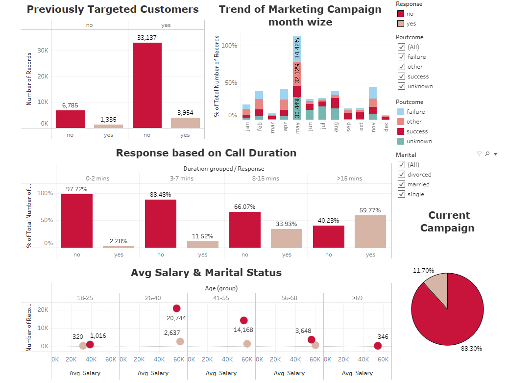

# Bank Marketing Campaign Analysis

This repository contains a machine learning project aimed at predicting the success of a Portuguese bank's phone-based marketing campaign. The goal is to identify strategies that will help increase client engagement and subscriptions to the bank's term deposit products in future campaigns.

## Project Overview

The dataset includes information about the bank's previous marketing campaigns, such as client demographics, previous contact results, and the outcome of previous campaigns. By analyzing this data, the project aims to predict whether a client will subscribe to the term deposit product based on the features provided.

## Objective

- **Problem:** Predict whether a customer will subscribe to the bank's term deposit product based on features like age, job, marital status, and contact information.
- **Solution:** Apply machine learning models to the dataset and use various classification algorithms to predict campaign success.
- **Outcome:** Improve marketing strategies by targeting the right customers and optimizing resource allocation.

## Datasets

- The dataset is provided in the `data/` folder.
- Features include demographic data, information about the client's previous interactions with the bank, and the outcome of those interactions.

## Models Used

The following machine learning models were used to solve the classification problem:

1. **Random Forest Classifier**
2. **XGBoost Classifier**
3. **AdaBoost Classifier**
4. **Gradient Boosting Classifier**
5. **Logistic Regression**
6. **Support Vector Classifier (SVC)**
7. **K-Nearest Neighbors Classifier (KNN)**
8. **Decision Tree Classifier**
9. **Gaussian Naive Bayes (NB)**

## Model Evaluation

The models were evaluated using the following metrics:

- **Accuracy:** The proportion of correct predictions made by the model.
- **Precision:** The proportion of positive predictions that were actually correct.
- **Recall:** The proportion of actual positive cases that were correctly predicted.
- **F1-Score:** The harmonic mean of precision and recall, balancing both metrics.
- **Confusion Matrix:** A table showing the true positive, false positive, true negative, and false negative results.

After tuning the hyperparameters, the **XGBoost Classifier** was found to perform the best, with the highest recall score, indicating its ability to correctly identify clients who are more likely to subscribe.

## Hyperparameter Tuning

Hyperparameters for models, especially **RandomForestClassifier** and **XGBoost**, were tuned using **GridSearchCV** to find the optimal parameters for the models.

- **Random Forest Classifier** achieved an accuracy score of 94% on the test data, with a recall of 92% and an F1-score of 94%.
- **XGBoost Classifier** performed slightly better with an accuracy of 94.29% and higher recall and precision scores.

## Results

- **Best Model:** XGBoost Classifier
- **Best Parameters for XGBoost:**
    - `n_estimators = 200`
    - `learning_rate = 0.1`
    - `max_depth = 5`
    - `subsample = 0.9`
    - `colsample_bytree = 0.9`

### Evaluation Metrics for XGBoost:
- **Accuracy:** 94.29%
- **Recall (Class 1):** 92%
- **F1-Score:** 94%
- **Confusion Matrix:** Showed that the model accurately identified both the "yes" and "no" subscription cases.

## Tableau Dashboard

You can also view the live Tableau dashboard by following the link below:

[Tableau Public Dashboard](https://public.tableau.com/app/profile/aryan.agarwal1594/viz/BankMarketingCampaignAnalysis_17312572029480/Dashboard6)

[](https://public.tableau.com/app/profile/aryan.agarwal1594/viz/BankMarketingCampaignAnalysis_17312572029480/Dashboard6)


## Getting Started
## Setup Instructions

Follow these steps to set up and run the project locally:

### 1. Clone the repository

First, clone the project repository to your local machine using the following command:

    ```bash
    git clone https://github.com/AryanAgarwal27/Bank_Marketing_Analysis.git
    cd Bank_Marketing_Analysis
## 2. Create and activate a virtual environment (optional but recommended)
Creating a virtual environment helps isolate the dependencies for the project. To create and activate a virtual environment, run:

### For Windows:
    ```bash
    python -m venv venv
    .\venv\Scripts\activate
### For MacOS
    ```bash
    python -m venv venv
    source venv/bin/activate
## 3. Install dependencies
The project has a list of dependencies stored in the `requirements.txt` file. Install them using:

    ```bash
    pip install -r requirements.txt
## 4. Accessing the dataset
The dataset used for this project is not included in the repository. However, you can download it from the [UCI Machine Learning Repository](https://archive.ics.uci.edu/ml/datasets/Bank+Marketing). Once downloaded, place the dataset (usually named `bank-marketing.csv`) into the `data/` folder in the project directory.

### Project Structure Example:
    ```plaintext
    Bank_Marketing_Analysis/
    │
    ├── data/
    │   └── bank-marketing.csv
    │
    ├── src/
    │   ├── model.py
    │   ├── data_preprocessing.py
    │   └── utils.py
    ├── Picture/
    │   ├── Accuracy_XGB.png
    │   ├── Confusion_Matrix_XGB.png
    │   └── Tableau_dashboard.png
    ├── requirements.txt
    ├── LICENSE
    ├── README.md
    └── main.py
## 5. Running the Project
Once the dependencies are installed and the dataset is in place, you can run the project locally.

To run the project and train the model, execute the following command:

    ```bash
    python main.py
## 6. Additional Notes
- If you want to modify the hyperparameters or try different models, you can find the relevant code in the `src/` folder, specifically in the `model.py` and `data_preprocessing.py` files.
- For more details on the project or to contribute, feel free to open an issue or create a pull request on GitHub.


    
## License

This project is licensed under the MIT License - see the [LICENSE](LICENSE) file for details.

